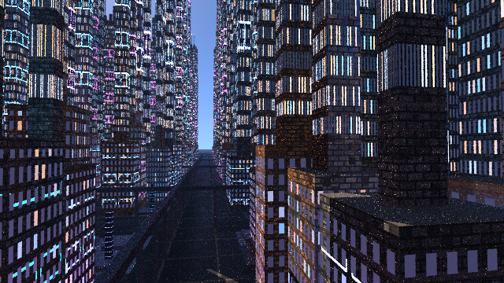

# 程序化霓虹都市 GI

面向 HPG 2026 Student Competition 主题 **Vast Proceduralism and Global Illumination** 的 ShaderToy 作品。

ShaderToy 链接：https://www.shadertoy.com/view/sXBGRw

语言：[English](README.md) | [中文](README.zh-CN.md) | [日本語](README.ja.md)



## 概览

`Procedural Neon Metropolis GI` 是一个两 pass 的 ShaderToy 程序化城市全局光照实验。场景完全在运行时生成：道路、广场、高架轨道、裙楼、塔楼、玻璃尖塔、暗色金属板楼、砖/复合立面、霓虹招牌、冷暖窗光、金属面板、玻璃幕墙和木质装饰都来自确定性的 cell hash。

渲染器采用混合 GI 路线：少量真实路径追踪负责 primary hit、太阳直射、硬阴影、GGX 材质、薄玻璃反射、部分 secondary bounce 和偶然命中的 emissive；确定性的城市 irradiance field 负责稳定的天空可见性、道路反弹、立面互反弹、窗户/霓虹色溢出和金属/玻璃的城市反射。

## 文件结构

- `FutureCity_BufferA.glsl`  
  主 ShaderToy Buffer A，包含程序化城市、路径追踪、GI 场、相机状态和时间累积。
- `FutureCity_Image.glsl`  
  显示 pass，用于隐藏 Buffer A 前四个状态像素并输出最终图像。
- `render_future_city_offline.js`  
  可选的本地 WebGL2 渲染脚本，用于生成预览帧或视频。
- `assets/preview.png`  
  本地验证预览图，分辨率 `640 x 360`。
- `docs/TECHNICAL_OVERVIEW.md`  
  英文技术说明。
- `docs/TECHNICAL_OVERVIEW.zh-CN.md`  
  中文技术说明。
- `docs/TECHNICAL_OVERVIEW.ja.md`  
  日文技术说明。
- `submission/`  
  比赛提交 notes 和邮件草稿。

## ShaderToy 配置

需要两个 ShaderToy pass：

- `Buffer A`：粘贴 `FutureCity_BufferA.glsl`
- `Image`：粘贴 `FutureCity_Image.glsl`

通道设置：

- Buffer A `iChannel0`：Buffer A 自身
- Buffer A `iChannel1`：Keyboard
- Image `iChannel0`：Buffer A

Buffer A 的前四个像素保存持久状态：

- `(0,0)`：相机位置
- `(1,0)`：yaw、pitch、camera moved flag
- `(2,0)`：鼠标位置和鼠标按下状态
- `(3,0)`：累积 sample 数

Image pass 会把这几个状态像素移出可见画面。

## 控制

- `W/S`：前进/后退
- `A/D`：左/右移动
- `E/Q`：上/下移动
- 鼠标拖拽：转动视角
- `Shift`：加速移动
- `R`：重置相机

## 当前渲染设置

- 每帧采样：`c_spp = 2`
- 相机移动时：1 个 surface hit
- 相机静止时：普通样本 2 个 surface hit
- 静止深路径样本：时间 checkerboard 子集使用 3 个 surface hit
- 直射光：一个带阴影检测的方向太阳光
- 路径续传：部分 secondary hit 也计算太阳直射
- 主几何遍历：有界 2D DDA city cell traversal
- 阴影遍历：更短的 DDA，加简化建筑 proxy bounds
- 时间累积：相机静止时在 Buffer A 内累积

## GI 摘要

GI 分为三层：

1. **显式路径追踪传输**  
   追踪 primary visibility、太阳阴影、GGX 反射、薄玻璃和少量 secondary stochastic bounce。

2. **程序化漫反射 irradiance field**  
   根据附近 cell 估计天空可见性、道路/广场反弹、立面互反弹、窗户/霓虹色溢出、街谷遮蔽和 cheap second bounce。

3. **程序化 specular/reflection field**  
   金属和玻璃会采样一个确定性的城市反射场，让附近霓虹、亮窗、道路、广场和远处 skyline 在低 sample count 下仍然可见。

这个做法不是完全无偏路径追踪，而是为 ShaderToy 约束设计的可控 GI。它避免依赖随机路径偶然命中很小的窗户或霓虹条，使间接光照更稳定、更容易被看出来。

## 本地验证

可选 renderer 使用 Playwright 和本地 Chrome/WebGL2。

```powershell
cd FutureCity_GitHub_Submission
npm install
$env:WIDTH="640"
$env:HEIGHT="360"
$env:FRAMES="4"
$env:DURATION_SECONDS="1"
$env:MODE="frames"
$env:FRAMES_DIR="FutureCity_frames"
node .\render_future_city_offline.js
```

最终提交 shader 的本地验证结果：

- 分辨率：`640 x 360`
- 测试帧数：4 帧
- 浏览器路径：Chrome/WebGL2 through ANGLE D3D11
- shader 编译后的渲染时间：约 `84.6 ms/frame`

大型程序化 shader 的首次编译可能明显慢于稳定运行时的单帧耗时。

## 比赛提交文件

`submission/` 文件夹包含：

- `FutureCity_SubmissionNotes.md`：配置、GI 摘要、性能说明和 checklist
- `FutureCity_SubmissionEmail.md`：英文邮件正文草稿
- `FutureCity_SubmissionEmail.eml`：邮件格式草稿

比赛官方提交邮箱：

`studentcompetition@highperformancegraphics.org`

